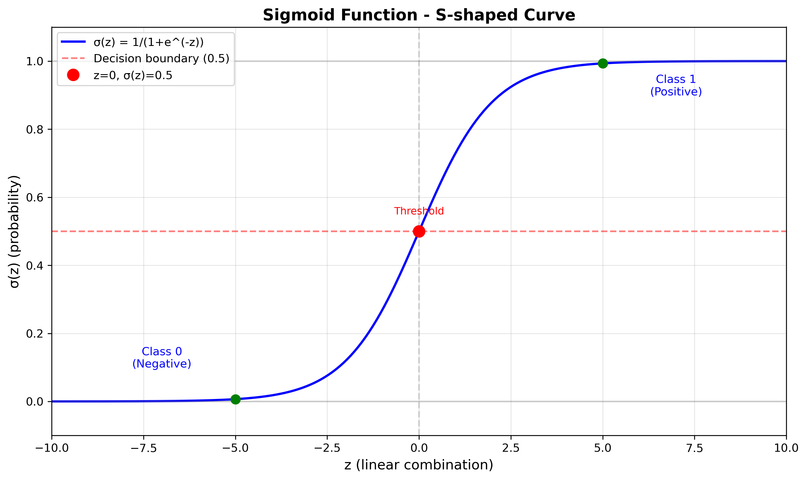

# Logistic Regression

## What is Logistic Regression?

Logistic Regression is a **classification algorithm** used to predict binary outcomes (Yes/No, True/False, 0/1). Despite its name, it's used for classification, not regression.

## Key Differences from Linear Regression

| Linear Regression | Logistic Regression |
|-------------------|---------------------|
| Predicts continuous values | Predicts probabilities (0 to 1) |
| Output: any real number | Output: between 0 and 1 |
| Example: House prices | Example: Email spam/not spam |

## The Sigmoid Function

Logistic regression uses the **sigmoid (logistic) function** to map predictions to probabilities:

```
σ(z) = 1 / (1 + e^(-z))
```

Where `z = wx + b` (linear combination)

**Properties:**
- Output range: (0, 1)
- S-shaped curve
- When z = 0, σ(z) = 0.5
- As z → ∞, σ(z) → 1
- As z → -∞, σ(z) → 0

### Understanding Sigmoid Properties

**1. Output range: (0, 1)**
- The sigmoid **always outputs values between 0 and 1**
- Never exactly 0 or 1, but approaches them
- Perfect for representing **probabilities**

**2. S-shaped curve**
- The graph looks like an "S" lying on its side
- Smooth transition from 0 to 1
- Creates a **decision boundary** at 0.5

**3. When z = 0, σ(z) = 0.5**
- At the **midpoint** (z=0), output is exactly 0.5
- This is the **decision threshold**
- Example: `σ(0) = 1/(1+e^0) = 1/2 = 0.5`

**4. As z → ∞, σ(z) → 1**
- For **very large positive** z values, sigmoid approaches 1
- Example: `σ(10) ≈ 0.9999` (very confident "Yes")
- Represents **high confidence** in positive class

**5. As z → -∞, σ(z) → 0**
- For **very large negative** z values, sigmoid approaches 0
- Example: `σ(-10) ≈ 0.0001` (very confident "No")
- Represents **high confidence** in negative class

### Visual Example:

```
z = -5  →  σ(z) ≈ 0.007  (almost 0, predict class 0)
z = -2  →  σ(z) ≈ 0.12   (low probability)
z =  0  →  σ(z) = 0.5    (uncertain, decision boundary)
z =  2  →  σ(z) ≈ 0.88   (high probability)
z =  5  →  σ(z) ≈ 0.993  (almost 1, predict class 1)
```

**Why These Properties Matter:**
- ✅ Outputs are interpretable as probabilities
- ✅ Smooth gradient for optimization
- ✅ Natural decision boundary at 0.5
- ✅ Handles extreme values gracefully

### Sigmoid Curve Visualization



The graph shows:
- **S-shaped curve** transitioning smoothly from 0 to 1
- **Decision boundary** at z=0 where σ(z)=0.5 (red dashed line)
- **Left side** (z < 0): Predicts Class 0 (negative)
- **Right side** (z > 0): Predicts Class 1 (positive)
- **Extreme values**: Approaches 0 and 1 asymptotically

## How It Works

1. **Linear Combination:** `z = w₁x₁ + w₂x₂ + ... + b`
2. **Apply Sigmoid:** `ŷ = σ(z) = 1 / (1 + e^(-z))`
3. **Decision Rule:** 
   - If ŷ ≥ 0.5 (equivalently, if z ≥ 0) → Predict class 1
   - If ŷ < 0.5 (equivalently, if z < 0) → Predict class 0

   (Recall: ŷ = σ(z), so the threshold ŷ = 0.5 corresponds to z = 0)
   - w·x + b >= 0 -> Predict class 1
   - w·x + b < 0 -> Predict class 0

Unlike linear regression (MSE), logistic regression uses **Binary Cross-Entropy Loss**:

```
J(w,b) = -1/m Σ [y·log(ŷ) + (1-y)·log(1-ŷ)]
```

**Why not MSE?**
- MSE with sigmoid creates non-convex function
- Hard to optimize (multiple local minima)
- Cross-entropy is convex → guaranteed convergence

## Training Process

1. Initialize weights and bias randomly
2. For each iteration:
   - Compute predictions: `ŷ = σ(wx + b)`
   - Calculate cost (cross-entropy)
   - Compute gradients:
     - `dw = (1/m) · X^T · (ŷ - y)`
     - `db = (1/m) · Σ(ŷ - y)`
   - Update parameters:
     - `w = w - α·dw`
     - `b = b - α·db`

## Common Use Cases

- **Email Classification:** Spam vs Not Spam
- **Medical Diagnosis:** Disease present vs absent
- **Credit Scoring:** Default vs No default
- **Customer Churn:** Will leave vs Will stay
- **Image Recognition:** Cat vs Dog (binary)

## Evaluation Metrics

- **Accuracy:** (TP + TN) / Total
- **Precision:** TP / (TP + FP)
- **Recall:** TP / (TP + FN)
- **F1-Score:** Harmonic mean of precision and recall
- **ROC-AUC:** Area under ROC curve

## Advantages

✅ Simple and interpretable
✅ Fast to train
✅ Works well with linearly separable data
✅ Outputs probabilities (not just classes)
✅ Less prone to overfitting with regularization

## Limitations

❌ Assumes linear decision boundary
❌ Struggles with complex non-linear relationships
❌ Sensitive to outliers
❌ Requires feature scaling for best performance
❌ Binary classification only (can extend to multiclass)

## Extensions

- **Multinomial Logistic Regression:** Multiple classes (>2)
- **Regularization:** L1 (Lasso) or L2 (Ridge) to prevent overfitting
- **Polynomial Features:** Handle non-linear boundaries

## Complete Implementation Example

### 1. Data Preparation
```python
import pandas as pd
import numpy as np
from sklearn.model_selection import train_test_split
from sklearn.preprocessing import StandardScaler

# Load data
data = pd.read_csv("tumor_data.csv")
X = data.drop('malignant', axis=1)
y = data['malignant']

# Train/test split
X_train, X_test, y_train, y_test = train_test_split(X, y, test_size=0.2, random_state=42)

# Standardize features
scaler = StandardScaler()
X_train = scaler.fit_transform(X_train)
X_test = scaler.transform(X_test)
```

### 2. Model Implementation
```python
# Sigmoid function
def sigmoid(z):
    return 1 / (1 + np.exp(-z))

# Initialize parameters
weights = np.zeros(X_train.shape[1])
bias = 0

# Training function
def train_logistic_regression(X, y, weights, bias, learning_rate, num_iterations):
    m = y.shape[0]
    loss_history = []
    
    for i in range(num_iterations):
        # Forward pass
        z = np.dot(X, weights) + bias
        y_pred = sigmoid(z)
        
        # Compute loss
        epsilon = 1e-15
        y_pred_clipped = np.clip(y_pred, epsilon, 1 - epsilon)
        loss = -(1/m) * np.sum(y * np.log(y_pred_clipped) + (1 - y) * np.log(1 - y_pred_clipped))
        loss_history.append(loss)
        
        # Compute gradients
        dw = (1/m) * np.dot(X.T, (y_pred - y))
        db = (1/m) * np.sum(y_pred - y)
        
        # Update parameters
        weights = weights - learning_rate * dw
        bias = bias - learning_rate * db
        
        if i % 100 == 0:
            print(f"Iteration {i}: Loss = {loss:.4f}")
    
    return weights, bias, loss_history

# Train
learning_rate = 0.01
num_iterations = 1000
y_train_array = y_train.values if hasattr(y_train, 'values') else y_train

final_weights, final_bias, loss_history = train_logistic_regression(
    X_train, y_train_array, weights, bias, learning_rate, num_iterations
)
```

### 3. Making Predictions
```python
# Predict on test set
z_test = np.dot(X_test, final_weights) + final_bias
y_pred_prob = sigmoid(z_test)
y_pred_labels = (y_pred_prob >= 0.5).astype(int)

# Evaluate
from sklearn.metrics import accuracy_score, classification_report
accuracy = accuracy_score(y_test, y_pred_labels)
print(f"Accuracy: {accuracy:.3f}")
print(classification_report(y_test, y_pred_labels))
```

### Results (Tumor Classification):
- **Initial Loss:** 0.693 (random guessing)
- **Final Loss:** 0.388 (after 1000 iterations)
- **Test Accuracy:** 83.5%

### 4. Visualize Training
```python
import matplotlib.pyplot as plt

plt.figure(figsize=(10, 6))
plt.plot(loss_history)
plt.xlabel('Iteration')
plt.ylabel('Loss')
plt.title('Training Loss Over Time')
plt.grid(True)
plt.show()
```

## When to Use

**Use Logistic Regression when:**
- Binary classification problem
- Need interpretable results
- Linear relationship between features and log-odds
- Want probability estimates
- Need fast training/prediction

**Don't use when:**
- Non-linear decision boundaries
- Multiple classes (use softmax/multinomial)
- Complex feature interactions
- Need high accuracy (try tree-based or neural networks)

## Summary

Logistic Regression transforms linear regression output through a sigmoid function to predict probabilities for binary classification. It's simple, fast, and interpretable, making it a great baseline model for classification tasks.


# COST FUNCTION
The cost function used in logistic regression is the **Binary Cross-Entropy Loss** (also known as Log Loss). It measures the performance of a classification model whose output is a probability value between 0 and 1.
The formula for the Binary Cross-Entropy Loss is:

```
J(w,b) = -1/m Σ [y·log(ŷ) + (1-y)·log(1-ŷ)]
```

Where:
- `J(w,b)` is the cost function
- `m` is the number of training examples
- `y` is the true label (0 or 1)
- `ŷ` is the predicted probability (output of the sigmoid function)
This cost function penalizes incorrect predictions more heavily, especially when the predicted probability is far from the true label. It is convex, which makes it easier to optimize using gradient descent methods.

# GRADIENT DESCENT
Gradient Descent is an optimization algorithm used to minimize the cost function in logistic regression. The goal
is to find the optimal weights `w` and bias `b` that minimize the Binary Cross-Entropy Loss.
The steps involved in gradient descent for logistic regression are as follows:
1. **Initialize** weights `w` and bias `b` randomly.
2. **Compute Predictions**: For each training example, compute the predicted probability using the sigmoid
function:
   ```
   ŷ = σ(wx + b)
   ```
3. **Calculate Cost**: Compute the cost using the Binary Cross-Entropy Loss function.
4. **Compute Gradients**: Calculate the gradients of the cost function with respect to the
weights and bias:
   ```
   dw = (1/m) · X^T · (ŷ - y)
   db = (1/m) · Σ(ŷ - y)
   ```
5. **Update Parameters**: Update the weights and bias using the computed gradients and a learning 
rate `α`:
   ```
   w = w - α·dw
   b = b - α·db
   ```
6. **Repeat**: Repeat steps 2-5 for a specified number of iterations or
until convergence (when the cost function stops decreasing significantly).
By iteratively updating the weights and bias in the direction that reduces the cost, gradient descent helps the logistic regression model learn the optimal parameters for accurate classification.

# PREDICTION
Once the logistic regression model is trained, predictions can be made on new data points using the learned
weights `w` and bias `b`. The prediction process involves the following steps:
1. **Compute Linear Combination**: For each new data point `x`, compute the linear combination of the
features and the learned weights, adding the bias:
   ```
   z = wx + b
   ```
2. **Apply Sigmoid Function**: Pass the linear combination `z` through the sigmoid
function to obtain the predicted probability `ŷ`:
   ```
   ŷ = σ(z) = 1 / (1 + e^(-z))
   ```
3. **Make Decision**
: Use a decision threshold (commonly 0.5) to classify the data point:
   - If ŷ ≥ 0.5, predict class 1
   - If ŷ < 0.5, predict class 0
This process allows the logistic regression model to classify new instances based on the learned relationship between the features
and the target variable. The output probability `ŷ` provides insight into the confidence of the prediction.


