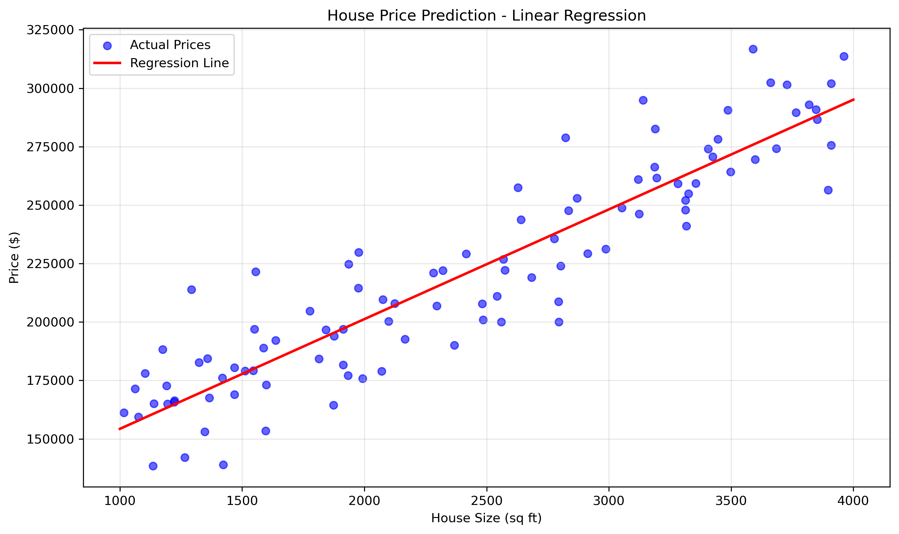
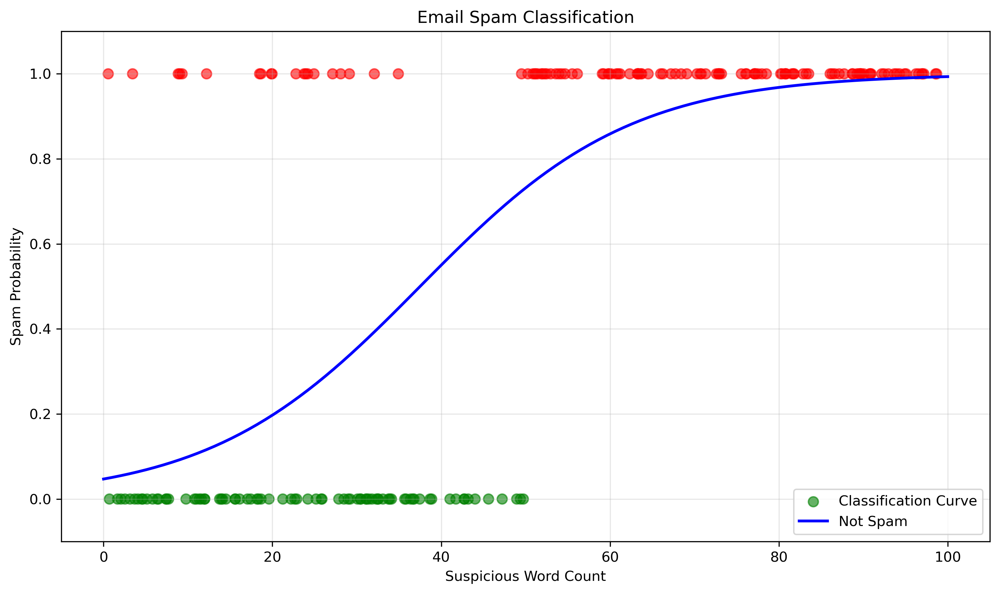
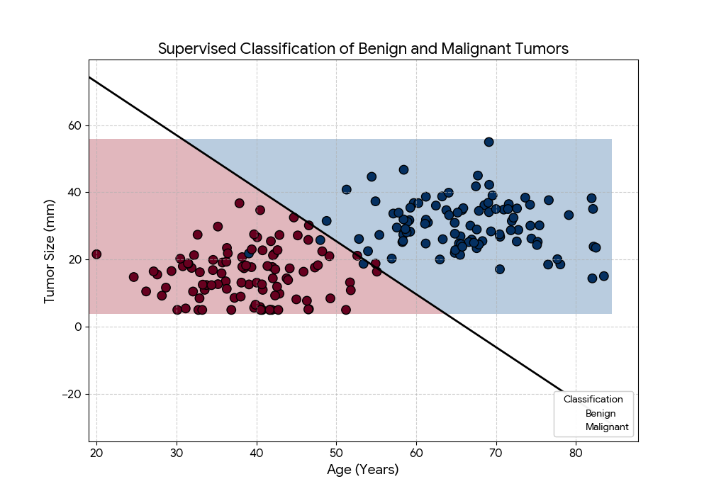

Supervised Learning are algorithms that learn x to y or input to output mappings. The key characteristics of supervised learning is that you give your learning algorith examples to learn from, which is usually the label y or sometimes called the Target. Example of a supervised learning is the house price prediction

There are two main types of supervised learning: regression and classification.

The above is an example of a regression problem, where the output is continuous i.e it can predict infinite numbers. Another example of supervised learning is classification, where the output is discrete,either 1 or 0, true or false or few classifications. An example of classification is spam detection, where the output is either spam or not spam.

The task of the linear regression algorithm is to find the perfect straight line or curve that will fit in the targets y. While for the classification algorith is to find a boundary between the data point.

In the above example, we have two features (x1 and x2) and two classes (red and blue). The task of the classification algorithm is to find a boundary that separates the red and blue classes. In this case, we can use a straight line to separate the two classes.